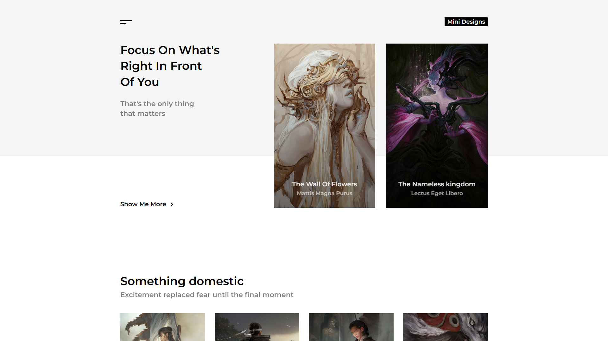

# Sass Guidelines And Conventions

Live demo: [sass-guidelines-and-conventions-nine.vercel.app](https://sass-guidelines-and-conventions-nine.vercel.app)

I really liked the simplicity in this design and tried to keep the application very simple as well. In this project I focused on writing best code for styling with sass. I followed sass best practices and BEM convention. The result is a responsive mobile first react web application that's easy to maintain and understand even as it scales. I also implemented extensive unit and integration testing for components using jest and react testing library.

## Technologies

- Typescript
- React
- Sass
- Jest
- React Testing Library

## Screenshots

